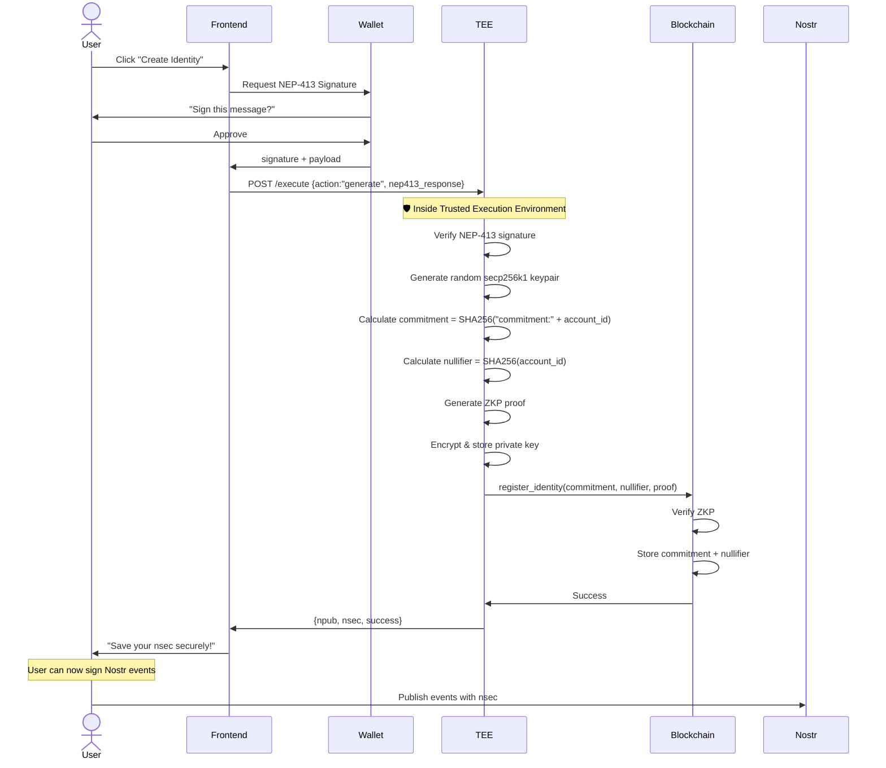
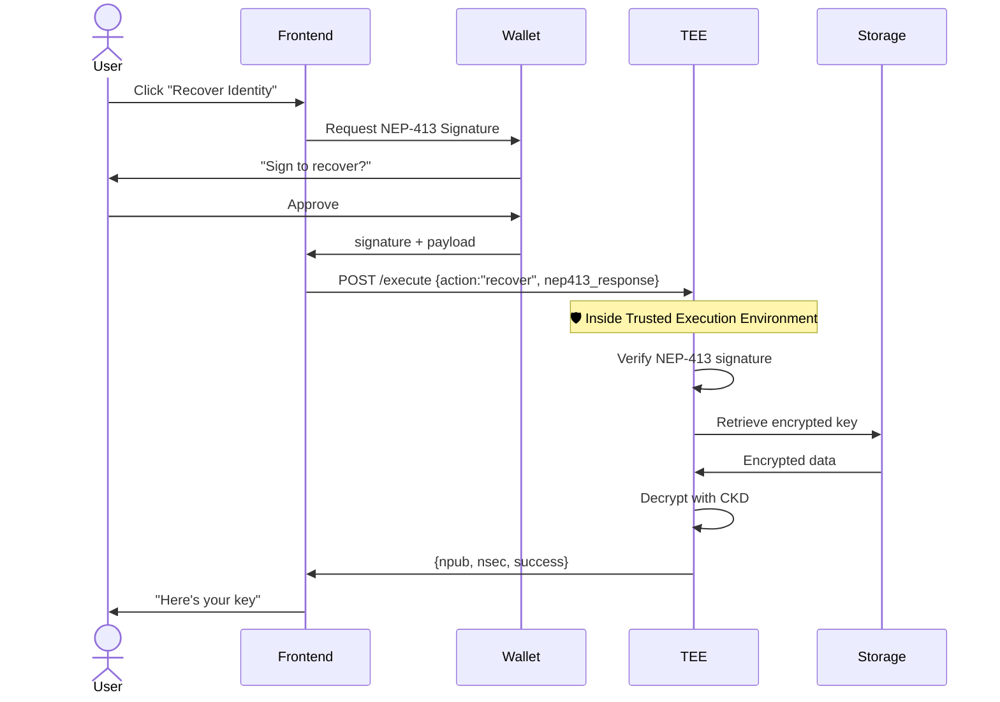

# Nostr Identity - Architecture & Consolidation Guide

## 🎯 System Overview

This system creates **privacy-preserving Nostr identities** bound to NEAR blockchain accounts with military-grade security.

---

## 📊 Architecture Diagram

```
┌─────────────────────────────────────────────────────────────────────────────┐
│                          USER LAYER                                         │
├─────────────────────────────────────────────────────────────────────────────┤
│                                                                             │
│  ┌──────────────┐      ┌──────────────┐      ┌──────────────┐            │
│  │  NEAR Wallet │      │   Nostr App  │      │  Frontend UI │            │
│  │  (my.near)   │      │  (Damus,etc) │      │   (Next.js)  │            │
│  └──────┬───────┘      └──────┬───────┘      └──────┬───────┘            │
│         │                     │                      │                     │
│         │ NEP-413 Sign        │                      │                     │
│         └─────────────────────┴──────────────────────┘                     │
│                                     │                                        │
└─────────────────────────────────────┼──────────────────────────────────────┘
                                      │
                                      ▼
┌─────────────────────────────────────────────────────────────────────────────┐
│                          TEE LAYER (OutLayer)                               │
├─────────────────────────────────────────────────────────────────────────────┤
│                                                                             │
│  ┌─────────────────────────────────────────────────────────────────┐       │
│  │        OutLayer TEE (Trusted Execution Environment)              │       │
│  │  ┌─────────────────────────────────────────────────────────┐    │       │
│  │  │  Rust WASM Contract (nostr-identity-contract-zkp-tee)   │    │       │
│  │  │                                                          │    │       │
│  │  │  1. NEP-413 Signature Verification                       │    │       │
│  │  │  2. Random Keypair Generation (secp256k1)                │    │       │
│  │  │  3. ZKP Proof Generation (Groth16)                       │    │       │
│  │  │  4. Encrypted Storage (CKD - Hardware Keys)              │    │       │
│  │  │  5. Identity Recovery                                    │    │       │
│  │  │  6. BUILT-IN DELEGATOR: Signs registrations              │    │       │
│  │  │     and calls NEAR contract as authorized delegator       │    │       │
│  │  └─────────────────────────────────────────────────────────┘    │       │
│  │                           │                                       │       │
│  │  ┌────────────────────────▼─────────────────────────────────┐    │       │
│  │  │  Persistent Storage (OutLayer API)                        │    │       │
│  │  │  - Encrypted with hardware-derived keys                   │    │       │
│  │  │  - User isolation enforced                                │    │       │
│  │  │  - Survives TEE restarts                                  │    │       │
│  │  └──────────────────────────────────────────────────────────┘    │       │
│  └─────────────────────────────────────────────────────────────────┘       │
│                                   │                                         │
└───────────────────────────────────┼─────────────────────────────────────────┘
                                    │
                                    ▼
┌─────────────────────────────────────────────────────────────────────────────┐
│                      BLOCKCHAIN LAYER (NEAR)                                │
├─────────────────────────────────────────────────────────────────────────────┤
│                                                                             │
│  ┌─────────────────────────────────────────────────────────────────┐       │
│  │           Smart Contract (Rust)                                 │       │
│  │  ┌─────────────────────────────────────────────────────────┐    │       │
│  │  │  Storage (On-Chain, Public)                              │    │       │
│  │  │  ┌──────────────┐  ┌──────────────┐  ┌──────────────┐  │    │       │
│  │  │  │ Commitment   │  │ Nullifier    │  │ Delegators   │  │    │       │
│  │  │  │ Hash (SHA256)│  │ (Prevents    │  │ (Authorized) │  │    │       │
│  │  │  │              │  │  Double-Reg) │  │ (TEE is one) │  │    │       │
│  │  │  └──────────────┘  └──────────────┘  └──────────────┘  │    │       │
│  │  │                                                          │    │       │
│  │  │  NO account_id stored (Privacy!)                         │    │       │
│  │  └─────────────────────────────────────────────────────────┘    │       │
│  │                                                                   │       │
│  │  Methods:                                                          │       │
│  │  - register_via_delegator(commitment, nullifier, delegator_sig)   │       │
│  │  - verify_identity(commitment)                                    │       │
│  │  - add_delegator(delegator_id)                                    │       │
│  │  - remove_delegator(delegator_id)                                 │       │
│  └─────────────────────────────────────────────────────────────────┘       │
│                                                                             │
└─────────────────────────────────────────────────────────────────────────────┘
```

---

## 🔄 Complete Data Flow

### **Identity Creation Flow**



### **Identity Recovery Flow**



### **How the Delegator Works (Built into TEE)**

The TEE contract has **built-in delegator functionality**:

1. User sends NEP-413 signature to TEE
2. TEE verifies signature and generates identity
3. **TEE signs the registration as an authorized delegator**
4. TEE calls `register_via_delegator()` on NEAR smart contract
5. Smart contract verifies TEE's delegator signature
6. Commitment/nullifier stored on-chain (no account_id!)

**Note:** There is NO separate delegator service - it's all in the TEE!

---

## 🔐 Security Layers

### **Layer 1: Forgery-Proof (NEP-413)**
- User signs message with wallet
- TEE verifies signature cryptographically
- Only wallet holder can pass

### **Layer 2: Secure Storage (TEE)**
- Random key generation in hardware enclave
- Encrypted storage with CKD (Cryptographic Derivation)
- User isolation via hardware

### **Layer 3: Zero-Knowledge Proofs**
- Groth16 ZKP proves account ownership
- Commitment scheme hides account_id
- Nullifier prevents double-registration

### **Layer 4: Blockchain Immutability**
- Commitment hash publicly verifiable
- Tamper-proof identity registry
- Decentralized validation

---

## 📂 Current Repository Structure

```
nostr-identity/
├── 📱 app/                          # Frontend (Next.js)
│   └── page.tsx                     # Main UI
├── 🔐 nostr-identity-contract-zkp-tee/  # TEE Backend (Rust WASM)
│   ├── src/lib.rs                   # Core logic
│   └── (WASM output)
├── 📜 nostr-identity-smart-contract/   # Smart Contract v1
├── 📜 nostr-identity-delegator-contract/  # Smart Contract v2 (Delegator)
├── 🔧 delegator-service/            # Off-chain delegator (TypeScript)
├── 🔬 nostr-identity-zkp/           # ZKP library (Circom)
│   ├── client/                      # Client-side ZKP
│   └── server/                      # Server-side ZKP
├── 📜 nostr-identity-contract/      # Legacy contract
└── 📜 nostr-identity-verification-contract/  # Verification contract
```

---

## 🗜️ Consolidation Plan

### **Phase 1: Consolidate Smart Contracts (High Priority)**

**Problem:** 5 different smart contract implementations
**Solution:** Keep only the production-ready one

```bash
# Keep this one (production-ready with ZKP)
nostr-identity-contract-zkp-tee/

# Archive these
archived/
├── nostr-identity-contract/
├── nostr-identity-smart-contract/
├── nostr-identity-delegator-contract/
└── nostr-identity-verification-contract/
```

### **Phase 2: Integrate Delegator Service**

**Current:** Separate service
**Better:** Feature-flagged module in main repo

```
services/
├── tee-backend/          # Current TEE (Rust WASM)
└── delegator/            # TypeScript service
    ├── src/
    │   ├── index.ts
    │   ├── nep413.ts
    │   └── database.ts
    └── package.json
```

### **Phase 3: ZKP Library Consolidation**

**Current:** Separate client/server folders
**Better:** Unified library

```
packages/
└── nostr-identity-zkp/
    ├── src/
    │   ├── circom/          # Circom circuits
    │   ├── proofs/          # Generated proofs
    │   ├── verification.ts  # Verification logic
    │   └── index.ts
    └── package.json
```

### **Phase 4: Monorepo Structure (Recommended)**

```
nostr-identity/
├── apps/
│   ├── web/                 # Frontend (Next.js)
│   │   ├── app/
│   │   ├── components/
│   │   └── package.json
│   └── storybook/           # UI components (optional)
├── services/
│   ├── tee-backend/         # Rust WASM for TEE
│   └── delegator/           # TypeScript delegator
├── contracts/
│   └── identity-contract/   # NEAR smart contract (Rust)
├── packages/
│   ├── zkp/                 # ZKP library
│   ├── nostr-keys/          # Nostr key utilities
│   └── near-connect/        # NEAR connection helpers
├── tooling/
│   ├── eslint-config/
│   ├── typescript-config/
│   └── prettier-config/
├── package.json             # Root package.json
├── pnpm-workspace.yaml      # Monorepo config
└── turbo.json               # Build system
```

---

## 🚀 Deployment Architecture

### **Production Setup**

```
┌─────────────────────────────────────────────────────────────┐
│                      DNS / CDN                              │
│                   nostr-identity.app                        │
└────────────────────────────┬────────────────────────────────┘
                             │
                             ▼
┌─────────────────────────────────────────────────────────────┐
│   Frontend (Vercel)                                         │
│   Next.js app                                               │
└────────────────────────────┬────────────────────────────────┘
                             │
                             ▼
┌─────────────────────────────────────────────────────────────┐
│   OutLayer TEE                                              │
│   - Identity generation                                     │
│   - Built-in delegator functionality                        │
│   - Encrypted storage                                       │
└────────────────────────────┬────────────────────────────────┘
                             │
                             ▼
┌─────────────────────────────────────────────────────────────┐
│   NEAR Blockchain (Mainnet)                                 │
│   - Smart contract                                          │
│   - Commitment/nullifier storage                            │
└─────────────────────────────────────────────────────────────┘
```

### **Deployment Commands**

```bash
# 1. Deploy Smart Contract
near deploy --accountId nostr-identity.near --wasm target/release/identity_contract.wasm

# 2. Deploy TEE Backend (includes built-in delegator)
cd contracts/nostr-identity-contract-zkp-tee
cargo build --target wasm32-wasip2 --release
outlayer deploy --name nostr-identity target/wasm32-wasip2/release/*.wasm

# 3. Deploy Frontend
cd apps/web
vercel --prod
```

---

## 🎯 Key Decision Points

### **The Delegator is Built-in:**
- ✅ **TEE has built-in delegator functionality** - no separate service needed!
- ✅ **Gas efficient** - TEE batches registrations when possible
- ✅ **Maximum privacy** - account_id never stored on-chain
- ✅ **Secure** - TEE signs as authorized delegator with hardware-protected keys

### **Architecture Benefits:**
- Simpler - No separate delegator service to manage
- More secure - Delegator keys in TEE hardware enclave
- Faster - Direct TEE → Blockchain communication
- Cheaper - No infrastructure costs for separate service

---

## 📊 Feature Comparison

| Feature | Current Implementation |
|---------|----------------------|
| Privacy | ⭐⭐⭐⭐⭐ (ZKP + commitment scheme) |
| Gas Cost | $$ (efficient batching in TEE) |
| Setup Complexity | Medium (TEE deployment) |
| Security | ⭐⭐⭐⭐⭐ (TEE + ZKP + NEP-413) |
| Scalability | High (TEE handles load) |
| Infrastructure | Low (only TEE + frontend needed) |

---

## 🧪 Testing Strategy

```bash
# Unit Tests
cargo test --package nostr-identity-contract-zkp-tee
npm test --workspace=packages/zkp

# Integration Tests
npm run test:integration

# E2E Tests (Playwright)
npm run test:e2e

# Smart Contract Tests (near-cli)
near call nostr-identity.test.testnet register_identity '...' --accountId test.testnet
```

---

## 📝 Next Steps

1. **Immediate:**
   - [ ] Archive unused smart contracts
   - [ ] Update documentation to reflect current architecture
   - [ ] Add deployment scripts

2. **Short-term:**
   - [ ] Consolidate to monorepo structure
   - [ ] Add comprehensive tests
   - [ ] Set up CI/CD pipeline

3. **Long-term:**
   - [ ] Add monitoring/analytics
   - [ ] Implement rate limiting
   - [ ] Add multi-chain support

---

## 🔗 Resources

- **NEAR Docs:** https://docs.near.org
- **OutLayer TEE:** https://outlayer.fastnear.com
- **NEP-413:** https://github.com/near/NEPs/blob/master/neps/nep-0413.md
- **Nostr Protocol:** https://github.com/nostr-protocol/nostr
- **Groth16 ZKP:** https://github.com/iden3/circomlibjs
