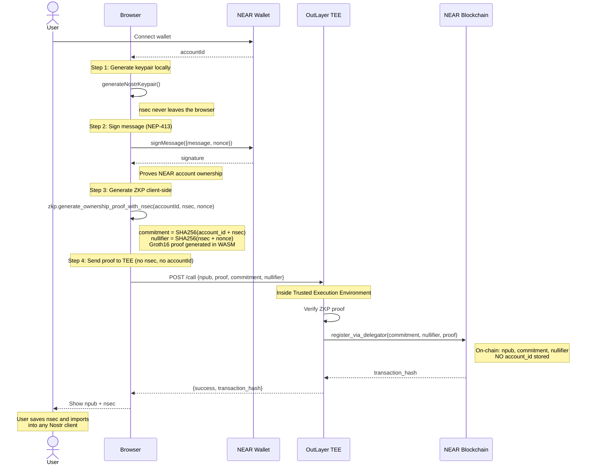
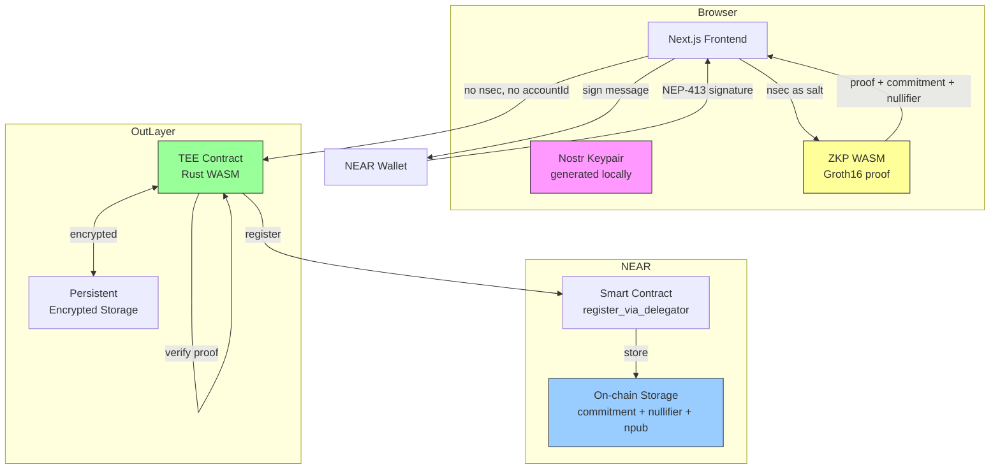

# Nostr Identity

Bind a Nostr identity (npub/nsec) to a NEAR account using zero-knowledge proofs and a TEE — without ever revealing which NEAR account owns which Nostr identity.

## How It Works

1. **Connect your NEAR wallet** — signs a message to prove account ownership (NEP-413).
2. **Nostr keypair is generated in your browser** — the private key (nsec) never leaves your device.
3. **A ZKP is computed client-side** — using the nsec as a salt, a proof is generated that binds the identity to your NEAR account without revealing the account on-chain.
4. **The proof is sent to an OutLayer TEE** — the TEE verifies the proof and registers the identity on the NEAR blockchain. The TEE never sees your nsec or account ID.

**Result:** On-chain, only the npub, a commitment (nsec-bound), and a nullifier exist. There is zero link to your NEAR account.

## Architecture





## Security Model

| Layer | What it does |
|-------|-------------|
| Client-side key generation | nsec is generated in the browser and never transmitted |
| Zero-knowledge proof | Proves NEAR account ownership without revealing the account |
| TEE attestation (OutLayer) | Secure, tamper-proof proof verification and on-chain registration |

The nsec cannot be recovered once generated. You must save it.

## Project Structure

```
nostr-identity/
├── app/                    # Next.js frontend (page.tsx, actions.ts)
├── packages/
│   ├── crypto/             # Nostr key generation, bech32 encoding
│   ├── nostr/              # Nostr protocol utilities
│   ├── types/              # Shared TypeScript types
│   └── zkp-wasm/           # ZKP proof generation (Rust → WASM)
├── contracts/
│   ├── nostr-identity-contract/           # Basic TEE contract
│   └── nostr-identity-contract-zkp-tee/   # Production ZKP+TEE contract
├── services/zkp/          # ZKP circuit implementation (Circom)
├── scripts/               # Build and test scripts
├── archived/              # Legacy contracts and services
└── docs/                  # Architecture, feature flags, security audit
```

## Development

Requires Node.js 18+, pnpm 8+, and Rust toolchain (for contracts/WASM).

```bash
# Install dependencies and build workspace packages
pnpm install

# Start the dev server
pnpm dev

# Build the ZKP WASM module
pnpm build:wasm

# Build the smart contract (Rust → WASM for OutLayer TEE)
pnpm build:contract

# Build everything
pnpm build:all
```

### Environment Variables

Copy `.env.example` to `.env.local` and fill in your OutLayer credentials:

```
OUTLAYER_PROJECT_ID=your-account.near/service-name
OUTLAYER_PAYMENT_KEY=your-account.near:nonce:secret_key
OUTLAYER_SECRETS_PROFILE=production
OUTLAYER_SECRETS_ACCOUNT_ID=your-account.near
NEXT_PUBLIC_CONTRACT_ID=nostr-identity.testnet
```

## Deployment

```bash
# Deploy to Vercel
vercel --prod

# Deploy TEE contract to OutLayer
cd contracts/nostr-identity-contract-zkp-tee
cargo build --target wasm32-wasip2 --release
outlayer deploy --name nostr-identity target/wasm32-wasip2/release/*.wasm
```

Alternative deployment to Cloudflare Pages:

```bash
pnpm cf:deploy
```

## Live Demo

https://nostr-identity.vercel.app

## License

MIT
